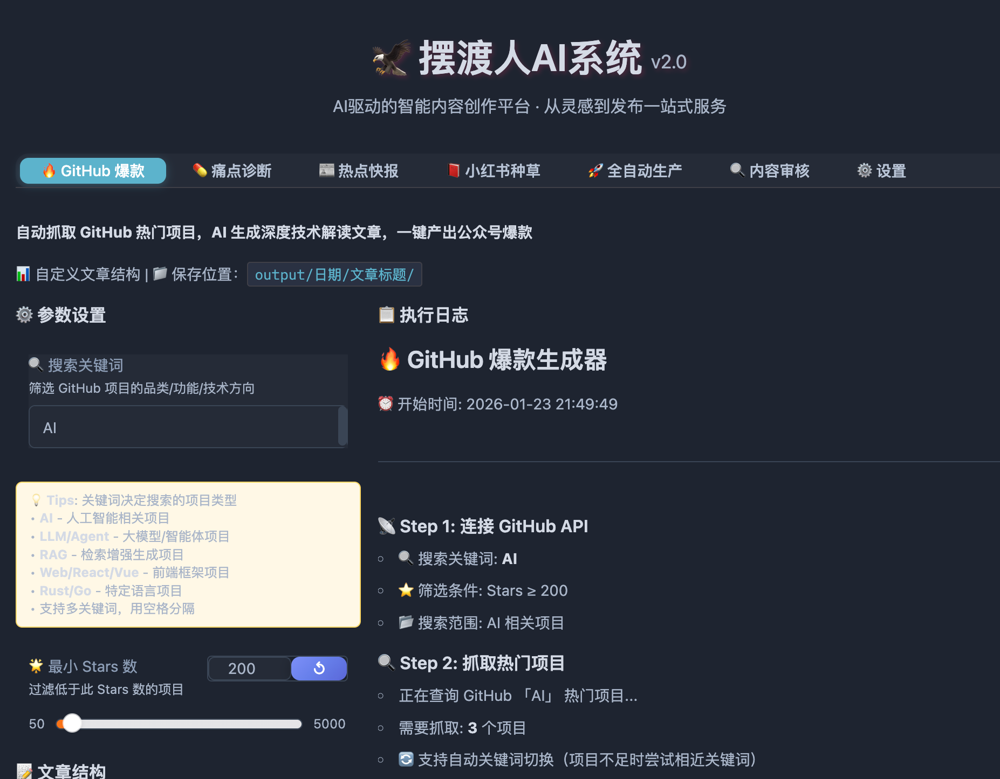

# Hunter AI 内容工厂
#### QQ群：794834282

<p align="center">
  <b>🌟 如果觉得有帮助，请点击 <a href="https://github.com/Pangu-Immortal/hunter-ai-content-factory/stargazers">Star</a> 关注不迷路！🌟</b>
</p>

<div align="center">


[](https://github.com/Pangu-Immortal/hunter-ai-content-factory)
[](LICENSE)
[](https://github.com/Pangu-Immortal/hunter-ai-content-factory/actions)
[](https://qm.qq.com/q/794834282)
[](https://github.com/Pangu-Immortal/hunter-ai-content-factory)

[](https://codespaces.new/Pangu-Immortal/hunter-ai-content-factory?quickstart=1)
[](https://huggingface.co/spaces/yugu88/hunter-ai-content-factory)


**🎯 内容生产也可以像写代码一样，有输入、有输出、有质量保证**

[快速开始](#-快速开始) · [功能特性](#-功能特性) · [模板介绍](#-五种内容模板) · [配置说明](#-配置说明) · [贡献指南](CONTRIBUTING.md)

</div>

<p align="center">
  <b>🌟 如果觉得有帮助，请点击 <a href="https://github.com/Pangu-Immortal/hunter-ai-content-factory/stargazers">Star</a> 关注不迷路！🌟</b>
</p>

---

## 📺 界面预览

<div align="center">



</div>

---

## ✨ 功能特性

<table>
<tr>
<td width="50%">

### 🔍 多平台数据采集
- **GitHub Trending** - 热门开源项目
- **Twitter/X** - 实时热点动态
- **Reddit** - 社区讨论话题
- **HackerNews** - 技术前沿资讯
- **小红书** - 生活消费热点

</td>
<td width="50%">

### 🤖 AI 智能生成
- **6-Skill 工作流** - 选题→调研→结构→写作→封装→发布
- **去 AI 味** - 有观点、有经验、可操作
- **语义去重** - ChromaDB 向量相似度检测
- **一键推送** - 微信 PushPlus 通知

</td>
</tr>
</table>

---

## ⚡ 快速开始

### 🌐 在线体验（无需安装）

<p align="center">
  <b>🌟 如果觉得有帮助，请点击 <a href="https://github.com/Pangu-Immortal/hunter-ai-content-factory/stargazers">Star</a> 关注不迷路！🌟</b>
</p>


<table>
<tr>
<td align="center" width="50%">

[](https://huggingface.co/spaces/yugu88/hunter-ai-content-factory)

**一键打开，直接使用**

</td>
<td align="center" width="50%">

[](https://codespaces.new/Pangu-Immortal/hunter-ai-content-factory?quickstart=1)

**在线开发环境，可修改代码**

</td>
</tr>
</table>

### 💻 本地部署

**空白电脑双击即可运行，自动下载 Python + 所有依赖！**

```bash
# Mac / Linux
bash run.sh

# Windows（双击运行）
run.bat
```

> 首次运行需下载环境约 3-5 分钟，之后秒启动

### 配置 API Key

启动后在 Web UI 的「⚙️ 配置」中填入 [Gemini API Key](https://aistudio.google.com/apikey)，点击保存即可。

---

## 📋 五种内容模板

| 模板 | 数据源 | 输出 | 适用场景 |
|:----:|:------:|:----:|:--------:|
| `github` | GitHub Trending | 公众号长文 | 技术博主 |
| `pain` | Twitter + Reddit | 诊断报告 | 产品经理 |
| `news` | 5 平台汇总 | 资讯快报 | 科技媒体 |
| `xhs` | 小红书热门 | 种草文章 | 生活博主 |
| `auto` | 全平台采集 | AI 生活黑客 | 全栈创作 |

```bash
# CLI 运行
uv run hunter run -t github    # GitHub 模板
uv run hunter run -t pain      # 痛点诊断
uv run hunter run --dry-run    # 试运行，不推送
```

---

## 🏗️ 核心架构

```
┌─────────────────────────────────────────────────────────────────┐
│                     Hunter AI 6-Skill 数据流                     │
├─────────────────────────────────────────────────────────────────┤
│                                                                 │
│   Topic ──→ Research ──→ Structure ──→ Write ──→ Package ──→ Publish
│   选题判断    深度调研     结构设计      内容写作    封装优化     发布推送
│                                                                 │
│   数据源 ──────────→ AI 分析 ──────────→ 内容输出 ──────────→ 推送
│   GitHub/Twitter/     Gemini 2.0        Markdown        PushPlus
│   Reddit/HN/小红书     Flash             公众号文章       微信通知
│                                                                 │
└─────────────────────────────────────────────────────────────────┘
```

---

## ⚙️ 配置说明

### 最小配置

```yaml
# config.yaml
gemini:
  api_key: "你的 Gemini API Key"
```

### 各模板所需配置

| 配置项 | github | pain | news | xhs |
|:------:|:------:|:----:|:----:|:---:|
| `gemini.api_key` | ✅ | ✅ | ✅ | ✅ |
| `github.token` | 可选 | - | - | - |
| `twitter.cookies_path` | - | ✅ | ✅ | - |
| `xiaohongshu.cookies` | - | - | - | ✅ |
| `pushplus.token` | 可选 | 可选 | 可选 | 可选 |

<details>
<summary>📝 完整配置示例</summary>

```yaml
# AI 大模型配置（必填）
gemini:
  api_key: "你的 API Key"
  model: "gemini-2.0-flash"

# GitHub 配置
github:
  token: "ghp_xxx"      # 可选，提高配额
  min_stars: 200

# Twitter 配置
twitter:
  cookies_path: "data/cookies.json"

# 小红书配置
xiaohongshu:
  cookies: ""           # 浏览器 F12 复制

# 推送配置
pushplus:
  token: "你的 Token"
  enabled: true

# 公众号人设
account:
  name: "AI技术前沿"
  tone: "专业且引人入胜"
  niche: "AI技术"
```

</details>

---

## 📁 工程结构

```
hunter-ai-content-factory/
├── src/
│   ├── intel/          # 📡 数据采集层
│   ├── templates/      # 📋 内容模板
│   ├── factory/        # 🏭 内容生产
│   └── utils/          # 🔧 工具函数
├── data/               # 数据存储
├── output/             # 输出目录
└── config.yaml         # 配置文件
```

---

## 🛠️ 技术栈

| 组件 | 技术选型 |
|:----:|:--------:|
| AI 模型 | Gemini 2.0 Flash |
| HTTP 客户端 | httpx |
| 浏览器自动化 | Playwright |
| 向量数据库 | ChromaDB |
| 关系数据库 | SQLite |
| 包管理 | uv |

---

## ❓ 常见问题

<details>
<summary>推送成功但公众号没有文章？</summary>

PushPlus 推送到的是**个人微信聊天窗口**，不是公众号。

查看：微信 → 「PushPlus 推送加」公众号 → 聊天窗口

发布：从 `output/` 目录复制文章，手动发布到公众号

</details>

<details>
<summary>GitHub API 返回 403？</summary>

API 限流，配置 `github.token` 提高配额（60→5000 次/小时）

</details>

<details>
<summary>小红书/Twitter 采集失败？</summary>

需要配置对应平台的 Cookie，详见配置说明

</details>

---

## 🤝 贡献

欢迎提交 Issue 和 Pull Request！详见 [贡献指南](CONTRIBUTING.md)

---

## 📖 开源引用

| 库 | 用途 |
|:--:|:----:|
| [httpx](https://github.com/encode/httpx) | HTTP 客户端 |
| [chromadb](https://github.com/chroma-core/chroma) | 向量数据库 |
| [playwright](https://github.com/microsoft/playwright) | 浏览器自动化 |
| [google-genai](https://github.com/google/generative-ai-python) | Gemini SDK |
| [gradio](https://github.com/gradio-app/gradio) | Web UI |

---

<div align="center">

## ⭐ Star 趋势

[](https://star-history.com/#Pangu-Immortal/hunter-ai-content-factory&Date)

**如果这个项目对你有帮助，请点个 ⭐ Star 支持一下！**

[](https://qm.qq.com/q/794834282)

</div>
